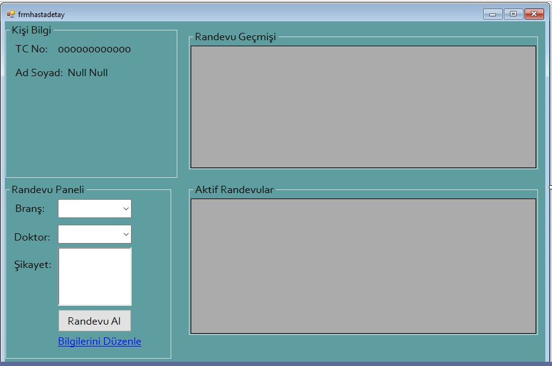

<h1><b>GÜMÜŞOLUK HASTANESİ RANDEVU OTOMASYONU</b></h1>

HASTA DOKTOR VE SEKRETER OLARAK ÜÇ TANE GİRİŞİMİZ OLACAK.

Hasta Girişi: Hasta TC kimlik no ve veritabanında kayıtlı şifresi ile giriş yapmaktadır.Eğer kaydı yoksa üye ol butonu ile kayıt olacaktır.

Eğer hasta kayıtlı değilse üye ol kısmına tıkladıktan sonra hasta kayıt formuna yönlenir.Hasta kayıt kısmında adını soyadını tcsini telefon ve şifresini girdikten sonra kayıt yap butonuna tıklayarak hastaneye kayıt olur ve veritabanına kendi bilgilerini kaydeder.

Hasta  hasatgiris.cs formundan tc kimlik no ve şifresi ile giriş yaptıktan sonra kendini hastadetay.cs formuna yönlendirir hasta detay kısmında ise hasta kişi bilgi kısmından kendine ait bilgileri görebilir randevu paneli kısmında branş doktor ve şikayet kısmını seçerek  randevu alabilir.Bilgilerini düzenle kısmından ise kendine ait bilgilerde güncelleme yapabilir.randevu geçmişi kısmından kendine ait eski randevuları aktif randevular kısmından şimdiki randevuları görebilir.

