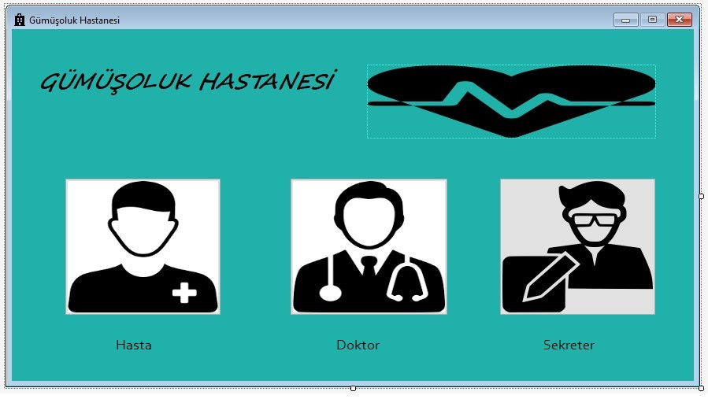
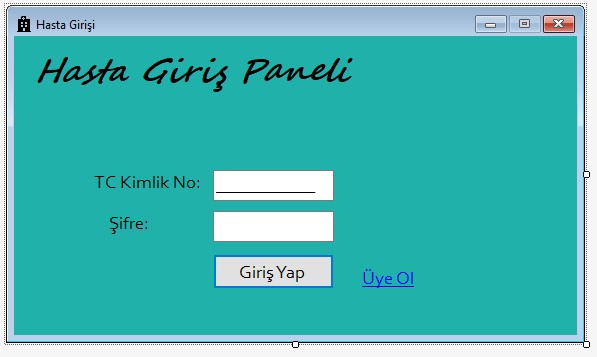

---------------------GÜMÜŞOLUK HASTANESİ RANDEVU OTOMASYONU--------------------------------------------

HASTA DOKTOR VE SEKRETER OLARAK ÜÇ TANE GİRİŞİMİZ OLACAK.

Hasta Girişi: Hasta TC kimlik no ve veritabanında kayıtlı şifresi ile giriş yapmaktadır.Eğer kaydı yoksa üye ol butonu ile kayıt olacaktır.

Eğer hasta kayıtlı değilse üye ol kısmına tıkladıktan sonra hasta kayıt formuna yönlenir.Hasta kayıt kısmında adını soyadını tcsini telefon ve şifresini girdikten sonra kayıt yap butonuna tıklayarak hastaneye kayıt olur ve veritabanına kendi bilgilerini kaydeder.

